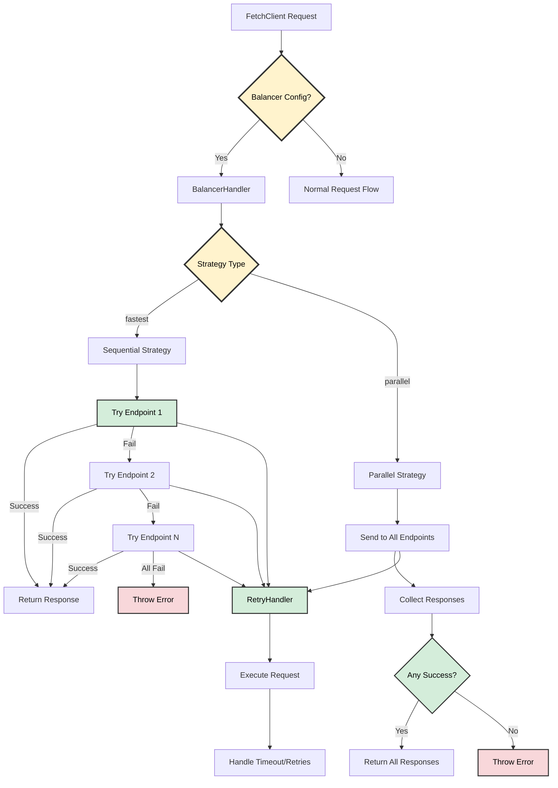

# ⚖️ Request Balancer Architecture

## 📋 Overview

The Request Balancer distributes HTTP requests across multiple endpoints to improve reliability and performance. It implements two strategies for handling endpoint failures and response collection.



## 🧩 Core Components

### 🔧 BalancerHandler
- **Location**: [`src/core/BalancerHandler.ts`](../../src/core/BalancerHandler.ts)
- **Purpose**: Manages request distribution logic
- **Key Methods**:
  - `executeWithBalancer()` - Main entry point for load balancing
  - `executeFastestStrategy()` - Sequential endpoint testing
  - `executeParallelStrategy()` - Parallel endpoint execution
  - `validateBalancerConfig()` - Configuration validation
  - `buildFullUrl()` - URL construction helper
- **Responsibilities**:
  - Validates endpoint configurations
  - Executes chosen balancing strategy
  - Handles endpoint failures gracefully

### 📝 BalancerConfig Interface
```typescript
interface BalancerConfig {
  // Array of endpoint URLs
  endpoints: string[]
  // Distribution strategy
  strategy: 'fastest' | 'parallel'
}
```

## 🎯 Return Types

### 📊 Strategy Return Types
- **`fastest` strategy**: Returns `FetchResponse<T>` (single response)
- **`parallel` strategy**: Returns `FetchResponse<T[]>` (array of responses)
- **Generic return**: `FetchResponse<T> | FetchResponse<T[]>` (union type)

### 🔧 Type Safety
The balancer provides full TypeScript support with proper return type inference.

📚 **For detailed examples and usage patterns, see [Request Balancer Examples](../examples/request-balancer.md)**

## 🎯 Strategies

### 1. 🚀 Fastest Strategy (`'fastest'`)

**Behavior**: Sequential endpoint testing until first success.

**Process**:
1. Iterates through endpoints in order
2. Executes request on current endpoint
3. Returns immediately on first successful response
4. Throws error if all endpoints fail

**Use Cases**:
- Primary/backup server setups
- Geographic failover
- Service redundancy

**Code Flow**: Sequential endpoint testing with immediate return on first success.

### 2. ⚡ Parallel Strategy (`'parallel'`)

**Behavior**: Simultaneous requests to all endpoints.

**Process**:
1. Sends requests to all endpoints concurrently
2. Collects all successful responses
3. Returns array of all successful data
4. Throws error if no endpoints succeed

**Use Cases**:
- Data aggregation from multiple sources
- Performance comparison
- Redundant data collection

**Code Flow**: Parallel execution with response aggregation.

## ❌ Error Handling

### 🔍 Validation Errors
- **Empty endpoints array**: Throws `BALANCER_ENDPOINTS_REQUIRED`
- **Invalid strategy**: Throws `BALANCER_STRATEGY_INVALID`
- **Invalid URL format**: Throws `Invalid endpoint URL: {url}`

### ⚠️ Runtime Errors
- **All endpoints fail**: Throws `All {count} endpoints failed`
- **Individual endpoint failures**: Logged but don't stop execution
- **Network timeouts**: Handled by underlying retry mechanism

## 🔗 URL Construction

### 🛠️ buildFullUrl Method
Constructs full URLs by combining endpoint base URLs with request paths, handling trailing slashes appropriately.

## 🔌 Integration with Fetch Client

### ⚙️ Configuration
Configure balancer with endpoints array and strategy selection.

### 🔄 Request Flow
1. **Validation**: Check balancer configuration
2. **Strategy Selection**: Route to appropriate handler
3. **Execution**: Run chosen strategy
4. **Response**: Return successful data or throw error

## 📊 Performance Characteristics

### 🚀 Fastest Strategy
- **Latency**: O(n) where n = number of endpoints
- **Success Rate**: High (tries all endpoints)
- **Resource Usage**: Low (one request at a time)

### ⚡ Parallel Strategy
- **Latency**: O(1) - time of slowest successful endpoint
- **Success Rate**: High (tries all endpoints simultaneously)
- **Resource Usage**: High (all requests concurrent)

## 🔄 Retry Integration

The balancer integrates with the existing retry mechanism for each endpoint attempt.

Each endpoint attempt includes:
- Configurable retry count
- Timeout handling
- Retry-After header respect
- Exponential backoff

## 🔒 Thread Safety

- **Stateless**: No shared state between requests
- **Concurrent Safe**: Multiple balancer instances can run simultaneously
- **Memory Efficient**: No persistent connections or state storage

## ⚠️ Limitations

1. **No Health Checks**: Doesn't verify endpoint availability before use
2. **No Load Metrics**: Doesn't consider endpoint performance history
3. **No Circuit Breakers**: Doesn't temporarily disable failing endpoints
4. **No Weighted Distribution**: All endpoints treated equally
