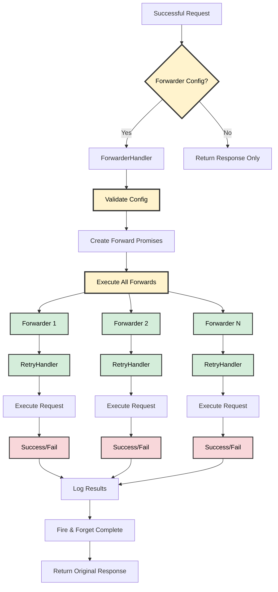

# 📨 Response Forwarder Architecture

## 📋 Overview

The Response Forwarder sends response data to multiple endpoints after successful requests. It implements fire-and-forget forwarding with retry logic and error handling for observability and data replication.

📚 **For detailed examples and usage patterns, see [Response Forwarder Examples](../examples/response-forwarder.md)**



## 🧩 Core Components

### 🔧 ForwarderHandler
- **Location**: [`src/core/ForwarderHandler.ts`](../../src/core/ForwarderHandler.ts)
- **Purpose**: Manages response forwarding logic
- **Key Methods**:
  - `forwardResponse()` - Fire-and-forget forwarding
  - `createConfig()` - Helper to create config from URL array
  - `createConfigFromForwarders()` - Helper to create config from ForwarderEndpoint array
- **Responsibilities**:
  - Validates forwarder configurations
  - Executes fire-and-forget forwarding
  - Handles individual forwarder failures
  - Logs forwarding results automatically

### 📝 ForwarderConfig Interface
```typescript
interface ForwarderConfig<T = unknown> {
  // Array of forwarder endpoints
  forwarders: ForwarderEndpoint<T>[]
}

interface ForwarderEndpoint<T = unknown> {
  // HTTP method for forwarding
  method: string
  // Target endpoint URL
  url: string
  // Optional headers
  headers?: Record<string, string>
  // Optional custom body or function
  body?: ForwarderBodyFunction<T> | Record<string, unknown> | string | number | boolean | null
  // Optional timeout (ms)
  timeout?: number
  // Optional retry count
  retries?: number
}

type ForwarderBodyFunction<T = unknown> = (originalResponse: T) => unknown
```

## 🎯 Forwarding Strategies

### 1. 🔥 Fire-and-Forget Strategy

**Behavior**: Sends responses to all endpoints without waiting for completion.

**Process**:
1. Validates forwarder configuration
2. Creates promises for all forwarders
3. Executes all forwards in parallel
4. Logs results asynchronously
5. Returns original response immediately

**Use Cases**:
- Logging and audit trails
- Analytics data collection
- Webhook notifications
- Data replication

**Code Flow**: Parallel execution with fire-and-forget completion logging.

### 2. 🔍 Automatic Logging Strategy

**Behavior**: Sends responses with automatic result logging and error tracking.

**Process**:
1. Validates forwarder configuration
2. Executes all forwards in parallel
3. Automatically logs all results
4. Tracks success/failure rates
5. Returns original response

**Use Cases**:
- Automatic monitoring and observability
- Built-in error tracking
- Debugging and troubleshooting
- Performance monitoring

**Code Flow**: Parallel execution with automatic logging and monitoring.

## ❌ Error Handling

### 🔍 Validation Errors
- **Empty forwarders array**: Throws `FORWARDER_ENDPOINTS_REQUIRED`
- **Invalid endpoint URL**: Throws `Invalid forwarder endpoint URL: {url}`
- **Missing endpoint URL**: Throws validation error

### ⚠️ Runtime Errors
- **Individual forwarder failures**: Logged but don't affect main response
- **Network timeouts**: Handled by retry mechanism
- **Invalid response data**: Handled gracefully

### 📊 Error Logging
Logs successful and failed forwarder attempts with detailed error information for debugging.

## 🔄 Retry Integration

The forwarder integrates with the existing retry mechanism for each forwarder attempt.

Each forwarder attempt includes:
- Configurable retry count per forwarder
- Individual timeout settings
- Retry-After header respect
- Exponential backoff

## 🔗 Request Transformation

### 🛠️ Body Transformation
Supports custom body data or uses original response data by default.

### 🚀 Enhanced Function-Based Bodies
The forwarder supports dynamic body generation using functions that receive the original response.

📚 **For detailed examples and usage patterns, see [Response Forwarder Examples](../examples/response-forwarder.md)**

### 📝 Header Transformation
Merges custom headers with forwarder-specific headers.

### 🔄 Method Transformation
Supports custom HTTP methods per forwarder with POST as default.

## 🔌 Integration with Fetch Client

### ⚙️ Configuration
Configure forwarder with array of endpoints, methods, headers, and optional body transformations.

### 🔄 Request Flow
1. **Main Request**: Execute primary request
2. **Success Check**: Verify main request succeeded
3. **Forwarder Execution**: Send to all configured endpoints
4. **Fire & Forget**: Don't wait for forwarder completion
5. **Response Return**: Return original response immediately

## 📊 Performance Characteristics

### 🔥 Fire-and-Forget Strategy
- **Latency**: O(1) - doesn't affect main response time
- **Success Rate**: High (retry logic per forwarder)
- **Resource Usage**: Medium (parallel execution)
- **Reliability**: High (individual failures don't affect main response)

### 🔍 Automatic Logging Strategy
- **Latency**: O(1) - doesn't affect main response time
- **Success Rate**: High (retry logic per forwarder)
- **Resource Usage**: Medium (parallel execution)
- **Monitoring**: Excellent (automatic logging and tracking)

## 🔒 Thread Safety

- **Stateless**: No shared state between requests
- **Concurrent Safe**: Multiple forwarder instances can run simultaneously
- **Memory Efficient**: No persistent connections or state storage
- **Isolated Failures**: Individual forwarder failures don't affect others

## ⚠️ Limitations

1. **No Guaranteed Delivery**: Fire-and-forget nature means no delivery confirmation
2. **No Ordering**: Forwarders execute in parallel, no guaranteed order
3. **No Batching**: Each forwarder is independent
4. **No Circuit Breakers**: Failing forwarders continue to retry
